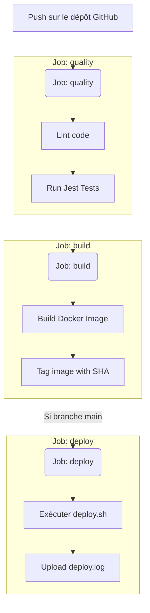
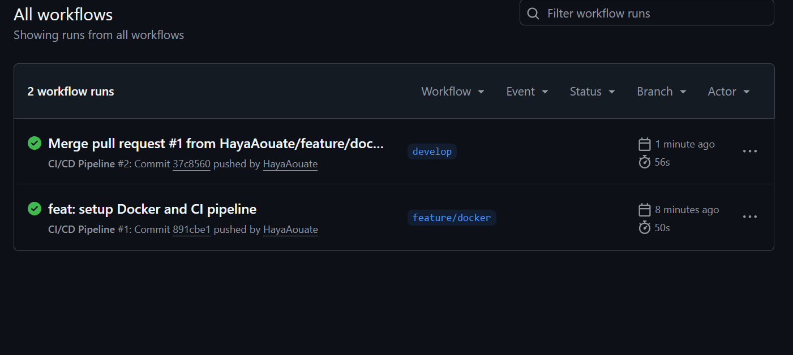
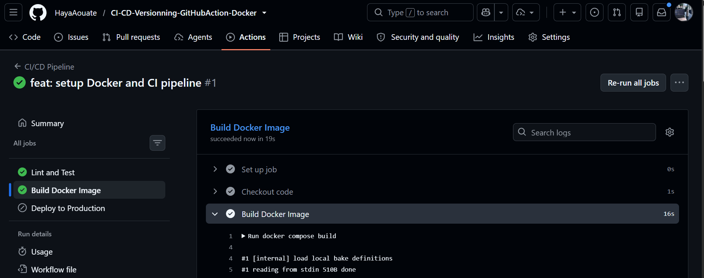
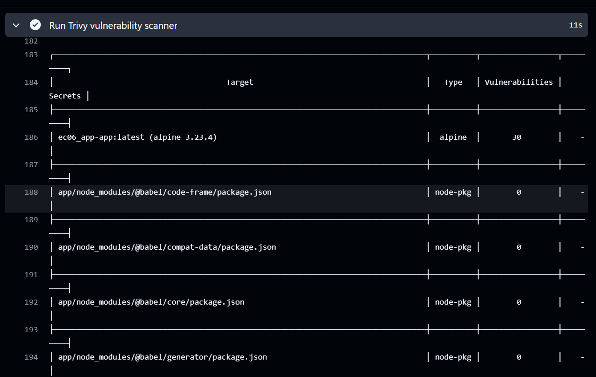
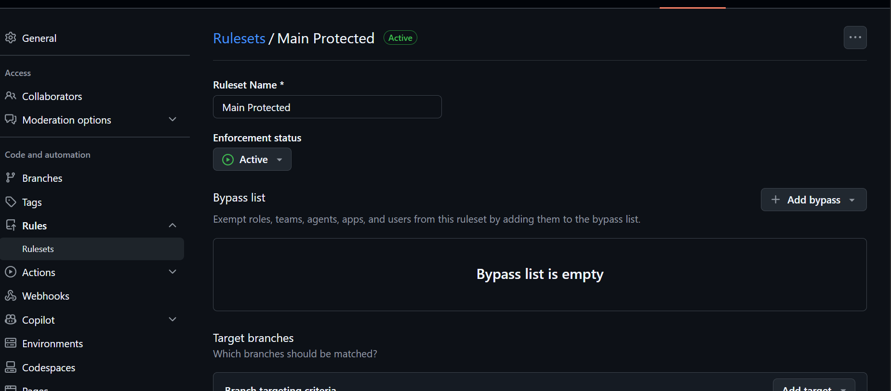
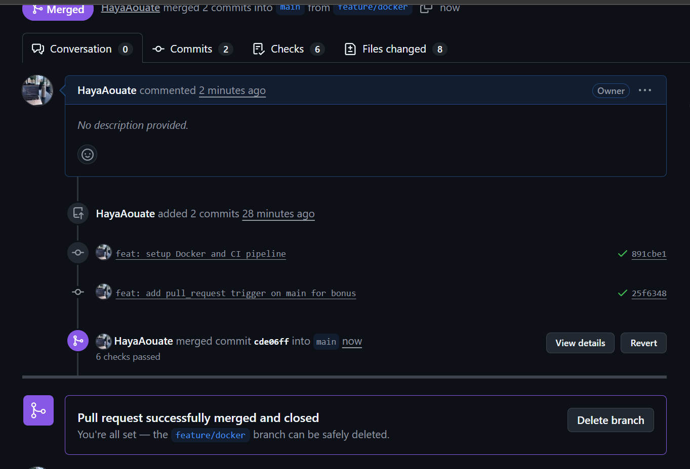
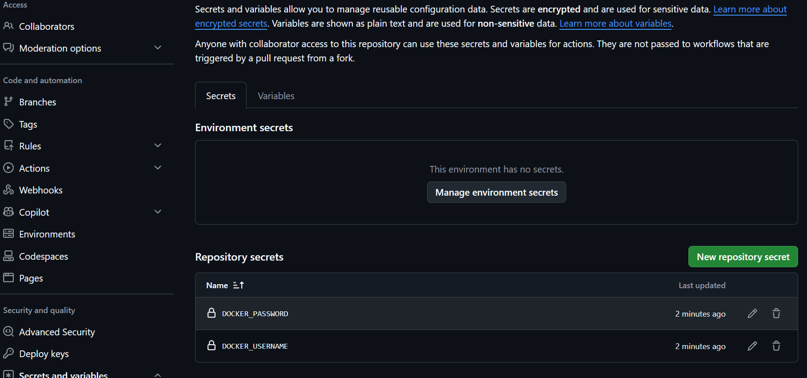

# Rapport d'épreuve EC06 - CI/CD et Versioning


**Projet :** SkillHub API
**Lien GitHub :** https://github.com/HayaAouate/CI-CD-Versionning-GitHubAction-Docker

## 1. Workflow Git et Docker

### Stratégie de branches
Pour ce projet, la stratégie choisie est **GitFlow simplifié**.
- **`main`** : Branche protégée, elle reflète le code en production. Le déploiement continu s'effectue depuis cette branche.
- **`develop`** : Branche d'intégration continue regroupant les nouvelles fonctionnalités.
- **`feature/*`** : Branches éphémères créées depuis `develop` pour le développement de nouvelles fonctionnalités (par ex. `feature/docker`), fusionnées ensuite via une **Pull Request**.

### Conteneurisation Docker
L'application a été conteneurisée à l'aide d'un `Dockerfile` **multistage** :
1. **L'étape builder** : se base sur l'image `node:20-alpine` pour installer toutes les dépendances avec `npm ci`.
2. **L'étape finale (runner)** : utilise la même image légère (`alpine`), récupère le strict nécessaire de l'étape de compilation, configure l'exécution sous l'utilisateur **non-root** `node` pour des questions de sécurité, expose le port `3000` et met en place un `HEALTHCHECK` régulier vérifiant le statut de l'API.

Le `docker-compose.yml` orchestre le lancement local :
- Un service **`app`** (notre API).
- Un service **`db`** (PostgreSQL 15), avec un volume `db-data` pour la persistance. L'API utilise les variables du fichier `.env`.

## 2. Architecture du pipeline CI/CD

Le pipeline d'intégration (fichier `.github/workflows/ci.yml`) se déclenche sur chaque `push`.



## 3. Gestion des secrets

- **.env et .env.dist** : Le fichier `.env` contenant les variables sensibles locales n'est **pas versionné** (inclus dans le `.gitignore`). Le fichier `.env.dist` est versionné avec des valeurs d'exemple ou vides.
- **GitHub Secrets** : Lors du déploiement réel ou des push vers des registres Docker, les identifiants sont stockés de manière chiffrée dans les **GitHub Secrets**.
- **Injection** : Ces secrets seront injectés via la syntaxe `${{ secrets.NOM_DU_SECRET }}` directement dans les variables d'environnement des jobs.

## 4. Retours d'expérience et bonus mis en place (Compte Rendu)

### 🐛 Problèmes rencontrés et résolus
- Lors de la mise en place de la protection de la branche `main`, l'option cachée *Require approvals* était cochée par défaut, empêchant la fusion des Pull Requests en étant seul sur le projet. L'option a été décochée dans les règles de la branche pour autoriser l'auto-fusion une fois que la CI est au vert.
- Le nom de l'image Docker a dû être forcé dans `docker-compose.yml` (`image: ec06_app-app:latest`) pour que les étapes de tag et de scan (Trivy) trouvent bien l'image sur le runner GitHub.

### 🚀 Bonus et sécurité (Piliers validés)
- **Historique des pipelines CI :** L'intégration continue s'exécute à chaque push et valide le lint, les tests et le build Docker.
<br>
- **Succès du Build Docker :** L'image Docker se construit parfaitement sur le runner GitHub.
<br>
- **Scan de vulnérabilités (Trivy) :** Ajouté dans le job `build` pour analyser l'image Docker fraîchement construite (`os,library`). Le scan trouve et affiche les vulnérabilités.
<br>
- **Protection de branche :** La branche `main` est configurée avec des *Branch Rulesets* exigeant une Pull Request validée et des status checks (CI au vert) avant toute fusion.
<br>
- **Déclencheurs multiples (PR Bonus) :** Le pipeline se déclenche spécifiquement sur `pull_request` (vers `main`), exigeant que les tests passent avant de pouvoir fusionner.
<br>
- **Gestion des Secrets :** Les identifiants virtuels (ex: Docker) ont été stockés en toute sécurité dans les variables GitHub (Secrets).
<br>
- **Permissions granulaires :** Ajout de `permissions: contents: read` au workflow pour respecter le principe du moindre privilège.
- **Badge d'état :** Un badge dynamique a été ajouté en haut de ce README pour suivre le statut de la CI en temps réel.

## 5. Instructions de lancement local

1. Cloner le dépôt.
2. S'assurer d'avoir copié `.env.dist` en `.env`.
3. Exécuter la commande :
   ```bash
   docker compose up --build
   ```
4. L'application est disponible sur http://localhost:3000.
