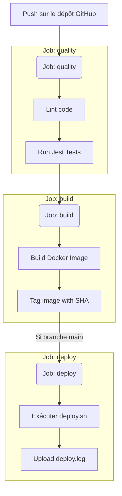

# Rapport d'épreuve EC06 - CI/CD et Versioning

**Projet :** SkillHub API
**Lien GitHub :** https://github.com/HayaAouate/CI-CD-Versionning-GitHubAction-Docker

## 1. Workflow Git et Docker

### Stratégie de branches
Pour ce projet, la stratégie choisie est **GitFlow simplifié**.
- **`main`** : Branche protégée, elle reflète le code en production. Le déploiement continu s'effectue depuis cette branche.
- **`develop`** : Branche d'intégration continue regroupant les nouvelles fonctionnalités.
- **`feature/*`** : Branches éphémères créées depuis `develop` pour le développement de nouvelles fonctionnalités (par ex. `feature/docker`), fusionnées ensuite via une **Pull Request**.

### Conteneurisation Docker
L'application a été conteneurisée à l'aide d'un `Dockerfile` **multistage** :
1. **L'étape builder** : se base sur l'image `node:20-alpine` pour installer toutes les dépendances avec `npm ci`.
2. **L'étape finale (runner)** : utilise la même image légère (`alpine`), récupère le strict nécessaire de l'étape de compilation, configure l'exécution sous l'utilisateur **non-root** `node` pour des questions de sécurité, expose le port `3000` et met en place un `HEALTHCHECK` régulier vérifiant le statut de l'API.

Le `docker-compose.yml` orchestre le lancement local :
- Un service **`app`** (notre API).
- Un service **`db`** (PostgreSQL 15), avec un volume `db-data` pour la persistance. L'API utilise les variables du fichier `.env`.

## 2. Architecture du pipeline CI/CD

Le pipeline d'intégration (fichier `.github/workflows/ci.yml`) se déclenche sur chaque `push`.



## 3. Gestion des secrets

- **.env et .env.dist** : Le fichier `.env` contenant les variables sensibles locales n'est **pas versionné** (inclus dans le `.gitignore`). Le fichier `.env.dist` est versionné avec des valeurs d'exemple ou vides.
- **GitHub Secrets** : Lors du déploiement réel ou des push vers des registres Docker, les identifiants sont stockés de manière chiffrée dans les **GitHub Secrets**.
- **Injection** : Ces secrets seront injectés via la syntaxe `${{ secrets.NOM_DU_SECRET }}` directement dans les variables d'environnement des jobs.

## 4. Instructions et limites

### Lancer le projet en local
1. Cloner le dépôt.
2. S'assurer d'avoir copié `.env.dist` en `.env`.
3. Exécuter la commande :
   ```bash
   docker compose up --build
   ```
4. L'application est disponible sur http://localhost:3000.

### Limites et améliorations futures
- **Limites actuelles** : Le déploiement (job `deploy`) n'est que simulé via un script `deploy.sh`.
- **Améliorations envisageables** : 
  - Ajout d'un système de scan de vulnérabilités (ex: Trivy) sur l'image Docker finale.
  - Mise en cache automatique de `node_modules` dans GitHub Actions pour accélérer la CI.
